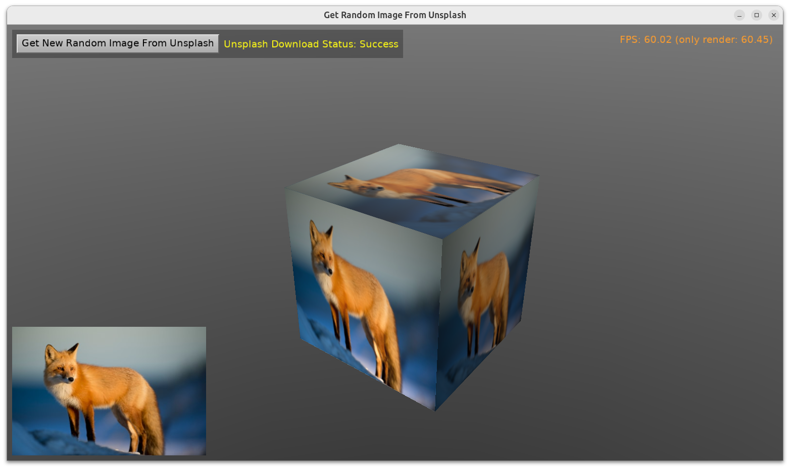

# Get Random Image From Unsplash

## Introduction

Ask [Unsplash](https://unsplash.com/) for a random image:

- matching given search terms (like `cute fox` in this example)

- and/or within a collection (like `8343314` for [adorable animals](https://unsplash.com/collections/8343314/adorable-animals)).

The images are generally [free to use (see Unsplash license)](https://unsplash.com/license) for various, though not all, purposes. And there's a ton of high-quality images.

The image is downloaded using our `TCastleDownload` in an asynchronous fashion, so your interactive application can keep going while the download goes in the background. If you want to just wait for the download to finish (block) that's of course also trivially possible, see the example code.

## Screenshot

## Use-cases

This demo simply shows using such image in the UI and as a texture for a 3D cube.

This can have a variety of use-cases in real applications. You can use a random pretty picture (randomized at design-time or run-time) e.g.

- as a background,

- as a puzzle base (moving tiles, arrange puzzles) etc.

## API key from Unsplash

To use this example, you need an API key ("access key") from Unsplash. Don't worry, it's rather trivial (and free) to obtain it :) Follow [Unsplash Developers](https://unsplash.com/developers), login there and create a new application. By default, it will be a _"demo application"_ with 50 requests/day limit, and it will instantly work.

Place your access key in the `code/unsplash_secrets.inc` file. Copy the file `code/unsplash_secrets.inc.template` to `code/unsplash_secrets.inc` and edit it to fill the `UnsplashAccessKey` constant.

## FPC + HTTPS + Linux

If you use FPC on Linux, note that older FPC (including 3.2.2) does not handle latest OpenSSL library versions.

If you get errors related to OpenSSL, upgrade to latest FPC (from GitLab) e.g. using [fpcupdeluxe](https://castle-engine.io/fpcupdeluxe).

## Building

Using [Castle Game Engine](https://castle-engine.io/).

Compile by:

- [CGE editor](https://castle-engine.io/editor). Just use menu items _"Compile"_ or _"Compile And Run"_.

- Or use [CGE command-line build tool](https://castle-engine.io/build_tool). Run `castle-engine compile` in this directory.

- Or use [Lazarus](https://www.lazarus-ide.org/). Open in Lazarus `random_image_from_unsplash_standalone.lpi` file and compile / run from Lazarus. Make sure to first register [CGE Lazarus packages](https://castle-engine.io/lazarus).

- Or use [Delphi](https://www.embarcadero.com/products/Delphi). Open in Delphi `random_image_from_unsplash_standalone.dproj` file and compile / run from Delphi. See [CGE and Delphi](https://castle-engine.io/delphi) documentation for details.